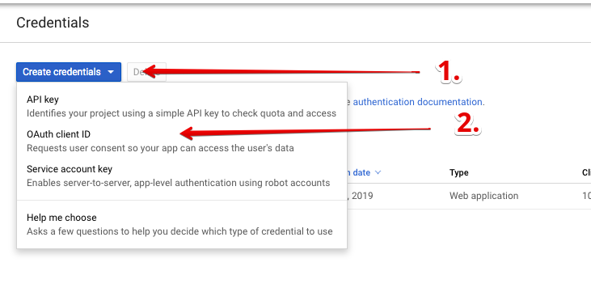
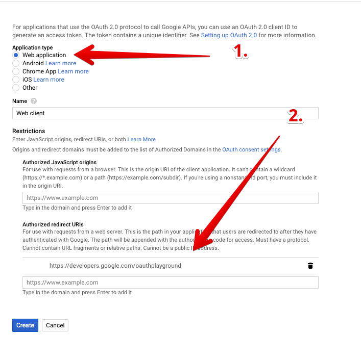
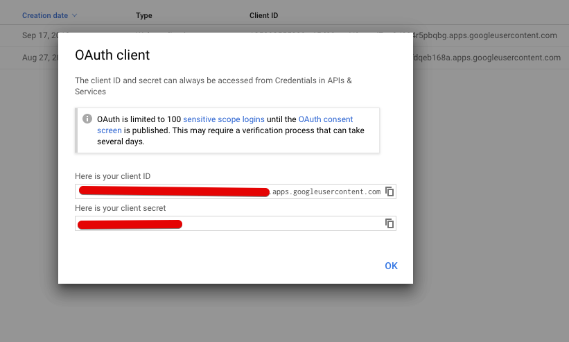
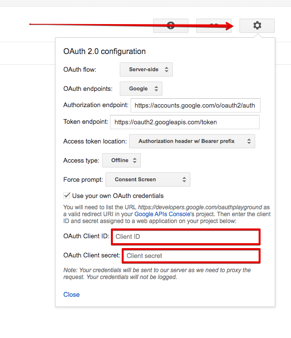
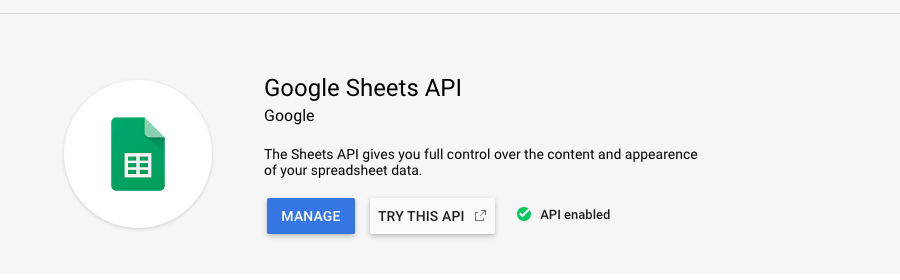
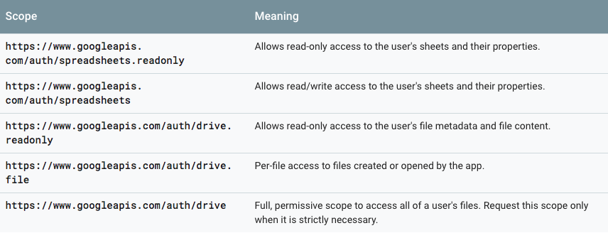
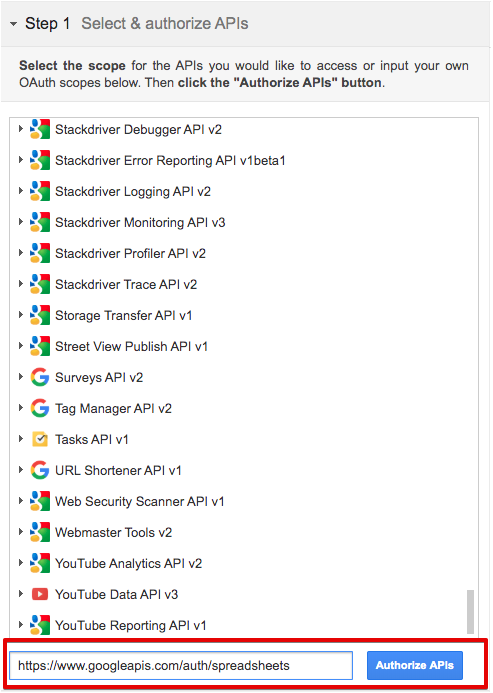
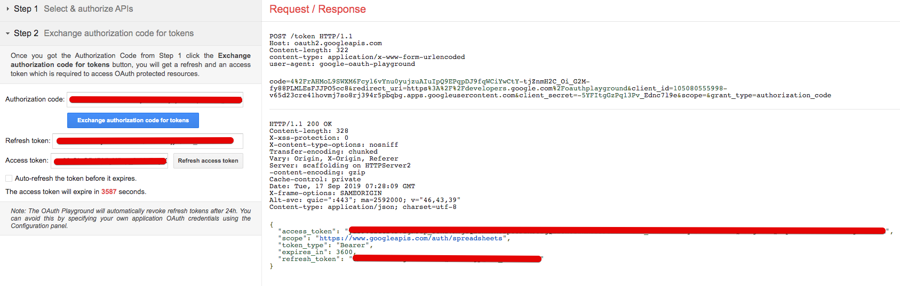

# Google Credentials 

## Using Auth 2.0 Credentials for API authorization 

### Generate Client ID and Secret Key 

Go to [Google Console](https://console.cloud.google.com/apis/credentials).  

1. Create OAuth 2.0 Credentials

    - Click the `Create credentials` button  
    - Select `OAuth client ID`

    

2. Set up Credentials

    - _Application type_ select as `Web application`  
    - Insert URL "[https://developers.google.com/oauthplayground](https://developers.google.com/oauthplayground)" into _Authorized redirect URIs_  
    - Click the `Create` button

    

3. Save your Client ID and Secret Key.

    

### Get Access and Refresh Tokens

Go to [OAuth 2.0 Playground](https://developers.google.com/oauthplayground/).

1. Fill `OAuth Client ID` and `OAuth Client secret` in OAuth 2.0 configuration form.

    

2. Choose the API and click the `Authorize APIs` button

    [List of Google APIs Library](https://console.cloud.google.com/apis/library)

    Using the Google Sheets API as an example:

    

    Scopes for API authorizations you can find on selected API documentation
    https://developers.google.com/sheets/api/guides/authorizing
    
    
    

3. Exchange authorization code for tokens

    After you can get authorization code & you can click "Exchange authorization code for tokens" button

    Congratulations! You are getting the refresh token!
    
    

[⬅️ Back](../README.md)
